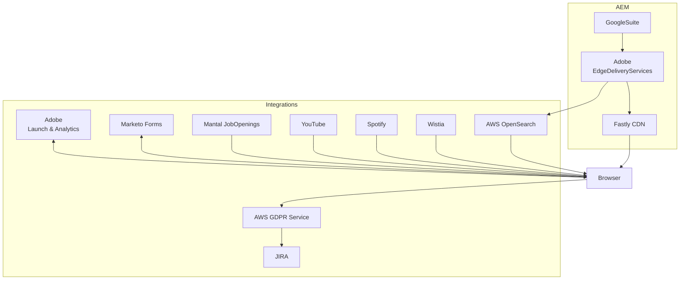

# Component and Integration Overview

```mermaid
flowchart TB

  subgraph AEM
    gsuite[GoogleSuite]
    eds["Adobe
EdgeDeliveryServices"]
    cdn[Fastly CDN]
  end

  browser[Browser]
  
  subgraph Integrations
    launch["Adobe
Launch & Analytics"]
    mantal[Mantal JobOpenings]
    gdpr[AWS GDPR Service]
    jira[JIRA]
    marketo[Marketo Forms]
    youtube[YouTube]
    spotify[Spotify]
    wistia[Wistia]
    search[AWS OpenSearch]
  end
  
  gsuite-->eds
  eds-->cdn
  cdn-->browser
  eds-->search

  browser-->gdpr

  launch<-->browser
  marketo<-->browser

  mantal-->browser
  gdpr-->jira
  youtube-->browser
  spotify-->browser
  wistia-->browser
  search-->browser
```
